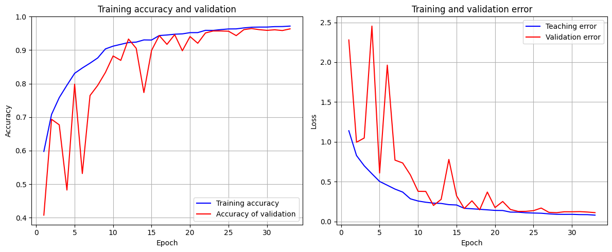
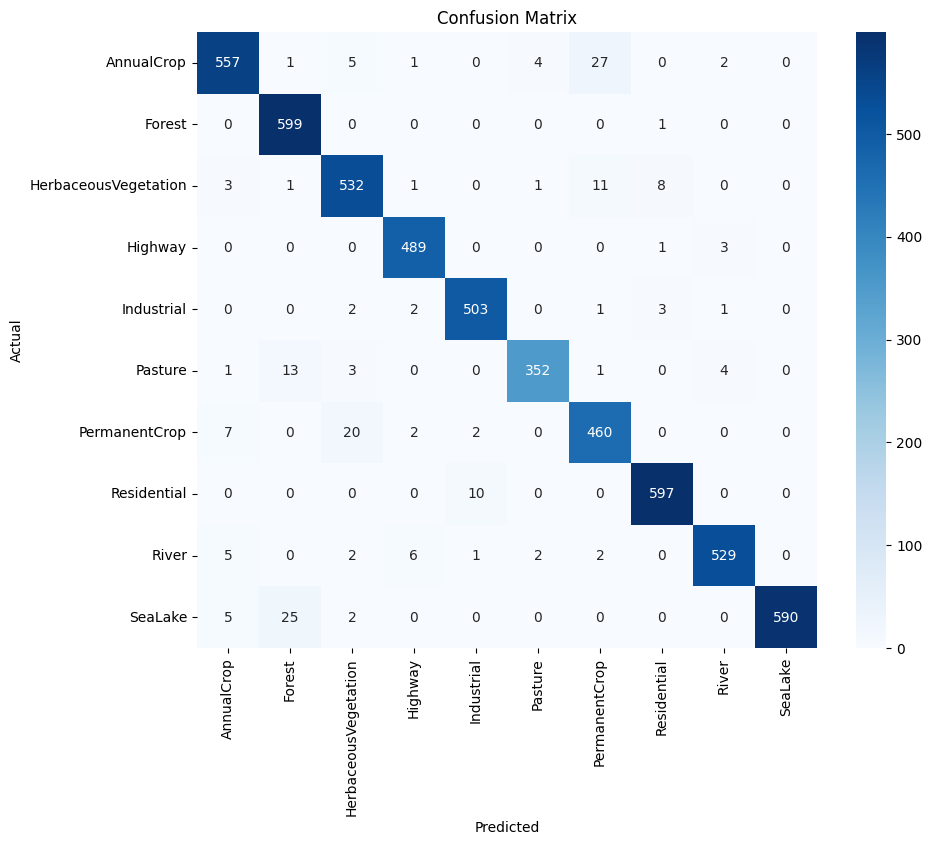

# 🛰️ EuroSAT Satellite Image Classification using CNN

## 📖 Project Overview
This project implements a **Deep Learning model** for classifying satellite images from the EuroSAT dataset. The model uses a **Convolutional Neural Network (CNN)** to recognize and classify land use patterns from satellite imagery captured by the Sentinel-2 satellite.

---

## 👨‍💻 Author
**Masoud Ghasemi**

- **GitHub**: [sorna-fast](https://github.com/sorna-fast)
- **Email**: [masudpythongit@gmail.com](mailto:masudpythongit@gmail.com)
- **linkedin**: [masoud-ghasemi](https://www.linkedin.com/in/masoud-ghasemi-748412381)
- **Telegram**: [@Masoud_Ghasemi_sorna_fast](https://t.me/Masoud_Ghasemi_sorna_fast)

---
---

## 🗂️ Project Structure
```
.
├── 📁 datasets/                 # Original dataset directory
│   └── EuroSAT_extracted/
│       └── 2750/               # Main dataset folder
├── 📁 model/                   # Trained models
│   └── best_model_epoch.keras  # Best trained model
├── 📁 notebooks/               # Jupyter notebooks
│   └── satellite-and-classifier.ipynb # EuroSAT CNN training notebook
├── 📁 visualizations/          # Generated plots and charts
│   ├── class_distribution.png  # Dataset class distribution
│   ├── confusion_matrix.png    # Model confusion matrix
│   ├── dataset_samples.png     # Sample images from dataset
│   └── training_history.png    # Training progress plots
├── 📄 requirements.txt         # Python dependencies
├── 📄 README.md               # Project documentation
└── 📄 .gitignore              # Git ignore file
```

---
## 📊 Dataset Information

### EuroSAT Dataset
- **Total Images**: 27,000
- **Image Size**: 64x64 pixels
- **Channels**: RGB (3 channels)
- **Classes**: 10 land use types

### Land Use Classes
1. **AnnualCrop**
2. **Forest**
3. **HerbaceousVegetation**
4. **Highway**
5. **Industrial**
6. **Pasture**
7. **PermanentCrop**
8. **Residential**
9. **River**
10. **SeaLake**

---

## 🏗️ Model Architecture

### Model Summary

| Layer (type) | Output Shape | Param # |
| :--- | :--- | :--- |
| data_augmentation (Sequential) | (None, 64, 64, 3) | 0 |
| conv2d_12 (Conv2D) | (None, 64, 64, 64) | 1,792 |
| batch_normalization_12 (BatchNormalization) | (None, 64, 64, 64) | 256 |
| conv2d_13 (Conv2D) | (None, 64, 64, 64) | 36,928 |
| batch_normalization_13 (BatchNormalization) | (None, 64, 64, 64) | 256 |
| max_pooling2d_6 (MaxPooling2D) | (None, 32, 32, 64) | 0 |
| conv2d_14 (Conv2D) | (None, 32, 32, 256) | 147,712 |
| batch_normalization_14 (BatchNormalization) | (None, 32, 32, 256) | 1,024 |
| max_pooling2d_7 (MaxPooling2D) | (None, 16, 16, 256) | 0 |
| conv2d_15 (Conv2D) | (None, 16, 16, 384) | 885,120 |
| batch_normalization_15 (BatchNormalization) | (None, 16, 16, 384) | 1,536 |
| conv2d_16 (Conv2D) | (None, 16, 16, 384) | 1,327,488 |
| batch_normalization_16 (BatchNormalization) | (None, 16, 16, 384) | 1,536 |
| conv2d_17 (Conv2D) | (None, 16, 16, 256) | 884,992 |
| batch_normalization_17 (BatchNormalization) | (None, 16, 16, 256) | 1,024 |
| max_pooling2d_8 (MaxPooling2D) | (None, 8, 8, 256) | 0 |
| global_average_pooling2d_2 (GlobalAveragePooling2D) | (None, 256) | 0 |
| dense_6 (Dense) | (None, 256) | 65,792 |
| dropout_4 (Dropout) | (None, 256) | 0 |
| dense_7 (Dense) | (None, 256) | 65,792 |
| dropout_5 (Dropout) | (None, 256) | 0 |
| dense_8 (Dense) | (None, 10) | 2,570 |

**Total Parameters**: 3,423,618

---

## 📈 Training Results & Performance

### Training Progress
The model was trained for 33 epochs with early stopping. Key training milestones:

- **Best Model**: Saved at Epoch 28 with **96.44% validation accuracy**
- **Final Training Accuracy**: **97.06%** (Epoch 28)
- **Training Stopped**: Epoch 33 due to early stopping
- **Learning Rate Adjustments**: Automatically reduced 4 times for optimal convergence

### Training History


### Model Evaluation Results

#### Overall Performance
- **Overall Accuracy**: **96%**
- **Macro Average F1-Score**: **0.96**
- **Weighted Average F1-Score**: **0.96**

#### Class-wise Accuracy
| Class | Accuracy |
| :--- | :--- |
| AnnualCrop | 93.3% |
| Forest | **99.8%** (Best) |
| HerbaceousVegetation | 96.0% |
| Highway | 99.0% |
| Industrial | 98.0% |
| Pasture | 94.1% |
| PermanentCrop | 93.7% |
| Residential | 98.4% |
| River | 96.7% |
| SeaLake | 94.9% |

#### Key Findings
- **Best Performing Class**: Forest (99.8% accuracy)
- **Most Challenging Class**: AnnualCrop (93.3% accuracy)
- **Most Common Misclassification**: AnnualCrop → PermanentCrop (27 samples)

### Confusion Matrix


### Detailed Classification Report
```
==================================================
Full Classification Report:
==================================================
                      precision    recall  f1-score   support

          AnnualCrop       0.96      0.93      0.95       597
              Forest       0.94      1.00      0.97       600
HerbaceousVegetation       0.94      0.96      0.95       557
             Highway       0.98      0.99      0.98       493
          Industrial       0.97      0.98      0.98       512
             Pasture       0.98      0.94      0.96       374
       PermanentCrop       0.92      0.94      0.93       491
         Residential       0.98      0.98      0.98       607
               River       0.98      0.97      0.97       547
             SeaLake       1.00      0.95      0.97       622

            accuracy                           0.96      5400
           macro avg       0.96      0.96      0.96      5400
        weighted avg       0.97      0.96      0.96      5400
```

---

## ⚙️ Installation & Setup

### Prerequisites
- Python 3.8+
- TensorFlow 2.x
- Jupyter Notebook

### Installation Steps

1. **Create virtual environment**
```bash
python -m venv myvenv
source myvenv/bin/activate  # On Windows: myvenv\Scripts\activate
```

2. **Install dependencies**
```bash
pip install -r requirements.txt
```

---

## 🔧 Hardware Configuration

### Important Hardware Configuration Note

**⚠️ Note: If you are not using Google Colab, GPU processing settings may differ:**

- **In Google Colab**: Uses Tesla T4 or similar GPU by default
- **In local environment**: Requires manual installation of CUDA and cuDNN drivers
- **Memory settings**: You may need to reduce batch size on systems with less GPU memory

```python
# Check GPU support
import tensorflow as tf
print("Number of available GPUs: ", len(tf.config.list_physical_devices('GPU')))
```

### Optimal Settings for Different Systems
- **GPU with 8GB+ memory**: `BATCH_SIZE = 32`
- **GPU with 4-8GB memory**: `BATCH_SIZE = 16`
- **CPU only**: `BATCH_SIZE = 8`

---

## 🚀 Usage

### Running the Project

1. **Open Jupyter Notebook**
```bash
jupyter notebook
```

2. **Choose your preferred notebook**:
   - `satellite-and-classifier-en.ipynb` - English version

3. **Execute cells sequentially** to:
   - Download and preprocess data
   - Train the CNN model
   - Evaluate model performance
   - Generate visualizations

### Key Configuration

```python
# Model parameters
IMG_SIZE = (64, 64)        # Input image size
BATCH_SIZE = 32           # Training batch size
EPOCHS = 40               # Maximum training epochs

# Data augmentation
data_augmentation = tf.keras.Sequential([
    RandomFlip("horizontal_and_vertical"),
    RandomRotation(0.25),
    RandomTranslation(0.2, 0.2),
    RandomZoom(0.2)
])
```

---

## 💡 Key Features

### Data Handling
✅ Automatic dataset download and extraction  
✅ Image preprocessing and normalization  
✅ Efficient data pipeline with caching  
✅ Balanced dataset handling  

### Model Development
✅ Custom CNN architecture  
✅ Comprehensive data augmentation  
✅ Batch normalization for stable training  
✅ Dropout for regularization  

### Training Management
✅ Automatic checkpointing  
✅ Early stopping  
✅ Learning rate scheduling  
✅ Progress monitoring  

### Evaluation & Visualization
✅ Confusion matrix analysis  
✅ Classification reports  
✅ Training history plots  
✅ Sample image visualization  

---

## 🎓 Applications

This model can be used for:
- **Land use mapping** and monitoring
- **Environmental research**
- **Urban planning**
- **Agricultural monitoring**
- **Disaster management**
- **Climate change studies**

---

## 📜 License

This project is for educational purposes. The EuroSAT dataset is provided for research use.

---

## 🙏 Acknowledgments

- **EuroSAT Dataset**: Helber et al. for the satellite imagery dataset
- **TensorFlow Team**: For the deep learning framework
- **Sentinel-2 Mission**: For providing satellite imagery

---

<div align="center">

**🌿 Using AI to understand our planet better**

**Achieved 96.4% Accuracy in Satellite Image Classification**

</div>